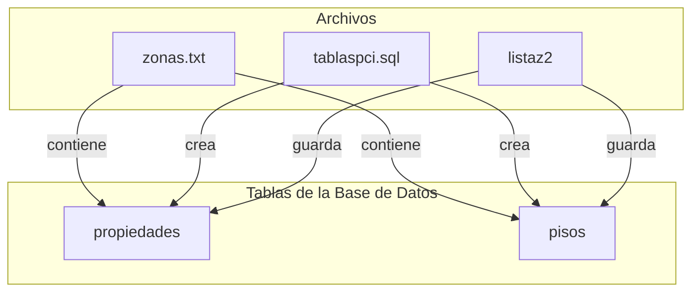

# Solving pCidades excercise using PHP instead of JAVA

## Description
The objective of this project is to solve the pCidades excercise using PHP instead of JAVA, here is the
stetements of the excercise:

## Excercise


We have a delimited text file named "zones" containing the code of a zone, its name, and the price per square meter separated by underscores (_).

We also have a script called "taboaspci.sql" that contains two tables named "properties" and "floors".

properties:
codp -> identification code of a floor
codz -> code of the zone where the floor is located

floors:
codp -> identification code of a floor
enderezo -> floor address
m2 -> surface area in square meters of the floor
nif -> floor owner's tax identification number
ano -> year the floor was built

Develop an application called "pcidades2" that displays the names of each of the zones from the delimited file "zones.txt", the number of floors located in each of those zones, and the total value of the floor prices in each of those zones. Take into account that the value of a floor is calculated by multiplying its square meters (field m2 in the floors table) by the price per square meter of the zone and subtracting an amount that depends on the number of years the floor has, according to the following scale:
- If the floor is over 30 years old, subtract 20,000.
- If the floor is over 20 and up to 30 years old (inclusive), subtract 10,000.
- If the floor is over 10 and up to 20 years old (inclusive), subtract 5,000.
- If the floor is 10 years old or less, subtract nothing.

The code, name, and total of each zone should be saved in a serialized file named "listaz2". The Java class "Listaz2.java" is provided to create and save the objects in the serialized object file "listaz2".

Essential: the project name must be exactly "pcidades2" (all lowercase).

IMPORTANT: If you do not work with NetBeans, remember that you must create a package containing your classes. This package must be named exactly "pcidades2", otherwise, you will not be able to read the serialized file "listaz2".

Scoring:
- Display code, name, and price per square meter of each zone: 2 points.
- Display the codes of each floor in the zone: 1.75 points.
- Display the square meters of each floor in the zone: 1.75 points.
- Display the total number of floors in each zone: 1 point.
- Display the total value of the floors in each zone: 1 point.
- Save the information in the serialized file named "listaz2": 1.5 points.

Contents of the delimited file "zones.txt":
z1_calvario_2300
z2_teis_2100
z3_rosalia_1000
z4_centro_3000
z5_principe_4000
z6_lavadores_2000
z7_travesia_1000
z8_traviesas_1600
z9_navia_1600
z10_bouzas_3000
z11_cabral_1400

Table "properties":
| codp | codz |
|------|------|
| p1   | z2   |
| p2   | z3   |
| p3   | z4   |
| p4   | z5   |
| p5   | z1   |
| p6   | z8   |
| p7   | z9   |
| p8   | z8   |
| p9   | z2   |
| p10  | z3   |
| p11  | z7   |
| p12  | z3   |
| p13  | z2   |
| p14  | z8   |
| p15  | z1   |


Table "floors":
| codp | enderezo | m2  |  nif  | ano  |
|------|----------|-----|-------|------|
| p1   | aaa      |  60 | 368l  | 1991 |
| ...  | ...      | ... | ...   | ...  |
| ...  | ...      | ... | ...   | ...  |
| ...  | ...      | ... | ...   | ...  |
| ...  | ...      | ... | ...   | ...  |
| ...  | ...      | ... | ...   | ...  |


...
(List of floors and their details)

Content of the final file "listaz2":
codz= z1, nomz= calvario, total=343000
codz= z2, nomz= teis, total=464000
codz= z3, nomz= rosalia, total=325000
codz= z4, nomz= centro, total=230000
...
(List of zones and their totals)


## Diagrams

Mermaid graph TD




# Solution

First of all we connect de database **postgres** so we have all the date storage and now we can work fluently with **PHP**

## Database

We have a database called **postgres** with two tables **properties** and **floors**:

## FILES

We have a file called **zones.txt** with the following content:

```txt
z1_calvario_2300
z2_teis_2100
z3_rosalia_1000
z4_centro_3000
z5_principe_4000
z6_lavadores_2000
z7_travesia_1000
z8_traviesas_1600
z9_navia_1600
z10_bouzas_3000
z11_cabral_1400
```
So we have to read this file and exract the information to compare with the perfect query to the database


